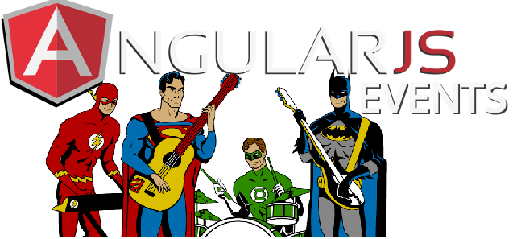

# AngularJS Events

This project is a simple application demonstrating a more fully developed realistic single page
angular application. The project have all code lines comented, angular examples and unit and e2e tests.

## How to use

Download and install the Node.Js using the [NVM](https://github.com/creationix/nvm).

Install the [yarn](https://yarnpkg.com/en/) following the official 
[documentation](https://yarnpkg.com/lang/en/docs/install/#linux-tab).

Clone the repository and install the node modules.

`yarn install`

Install the Bower globally:

`yarn global add bower`

Install the Bower components:

`bower install`

After this, you can run the application.

***

### Running the application

If you are using Linux machine use the terminal to go to the root of the project and run the server.sh script.

If you are on a windows machine, install the bash shell.  Optionally you may run server.bat.  Note that
after you stop your server, you must change directory back to the root of the project.

Then navigate your browser to `http://localhost:<port>` to see the app running in
your browser.  The port may be configured in the scripts/web-server.js file near the top. The default port is 8000.

#### Logging in
You can inspect the files in the app/data/user directory, or just use the login "admin"/"admin".  
Some of the functionality are disabled if you are not logged in.

#### Server

The server is a simple node server that just writes and reads files from the disk in a restful manner. 
This keeps the entire project self-contained, but it puts some limitations because the server has no logic whatsoever.

The web-server.js code was borrowed from the [angularjs.org](https://angularjs.org/) tutorial ([angular-phonecat](https://github.com/angular/angular-phonecat))

***

### Running the tests

To run the test, you need to configure your environment. To do this you need to install 
[Protractor](https://angular.github.io/protractor/#/) and [Karma](https://karma-runner.github.io) 
and install all the node modules and bower components modules needed to run this application as shown above.

#### Unit tests

I created a article in my blog of how to configure the Karma for tests in the WebStorm IDE and how to run Unit tests, 
you can see in this [link](http://coderade.io/configure-karma-webstorm).

#### End2End tests
I created a article in my blog of how to configure the Protractor for tests in the WebStorm IDE and how to run E2E tests,
 you can see in this [link](http://coderade.io/setting-protractor-webstorm).

***

For more information on AngularJS please check out [AngularJS](http://angularjs.org).

If you have some question about this project, please [contact me](http://coderade.io/contact) 
and I will try to answer as quickly as possible.
